# Multi-Vendor Marketplace — Live Demo

A complete online marketplace in the style of Amazon, AliExpress or Etsy:
many independent shops sell on one storefront, shoppers buy from several shops
in a single checkout, and the platform owner runs everything from an admin
panel.

### 👉 [Open the live demo: ecommerce.aliahad.com](https://ecommerce.aliahad.com)

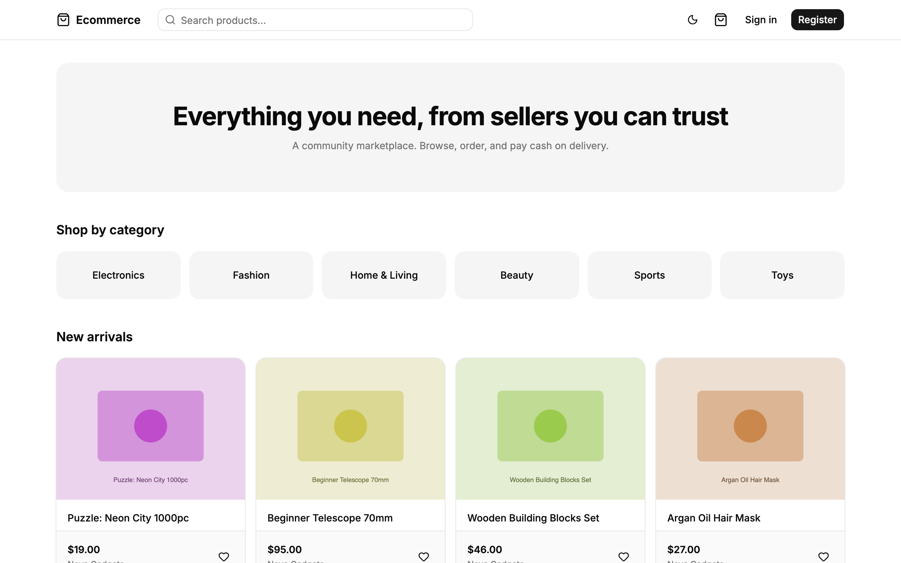

---

## Demo accounts

Sign in with any of these accounts to see each side of the marketplace:

| Role | What you can do | Email | Password |
| --- | --- | --- | --- |
| **Shopper** | Browse, buy, pay, track and review orders | `buyer@dev.local` | `90c0866a5106` |
| **Seller** | Manage a shop, products and incoming orders | `seller@dev.local` | `90c0866a5106` |
| **Admin** | Run the whole marketplace | `admin@example.com` | `fa52532157b96a7fa696a875` |

You can also **register your own shopper account** in a few seconds — no email
confirmation needed.

> This is a shared demo: other visitors use the same accounts, so you may see
> their orders. Payments are simulated and no real emails are sent.

---

## A 5-minute tour

### 1. As a shopper

1. **Browse** the storefront, open a category and narrow results with the
   filters (price, rating, material…).
2. **Open a product** — pick a size or colour; price, stock and SKU update for
   that option.
3. **Add to cart**, open the cart and enter the coupon code **`E2E10`** for
   10% off *(one use per account — register your own account to try it)*.
4. **Check out**: add a delivery address and choose a payment method:
   - **Cash on delivery** — the order is placed immediately.
   - **Card** — you're taken to a simulated payment page. Click **Pay now**,
     or **Simulate failure** and then **Retry payment** from the order page.
5. **Track the order** under *My orders*: each shop's part of the order shows
   its own status, and you can cancel it while it's still being prepared.
6. After delivery, **leave a review** with a star rating and photos.

| Find products | Choose options |
| --- | --- |
| 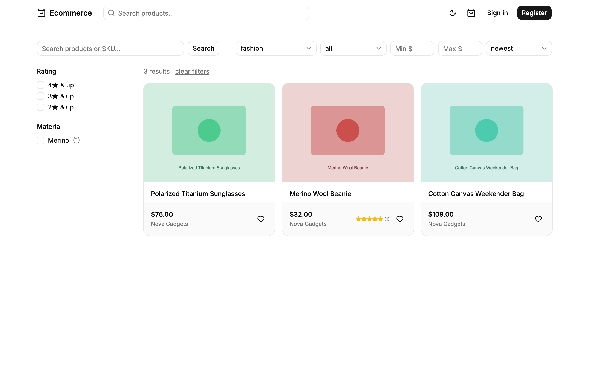 | 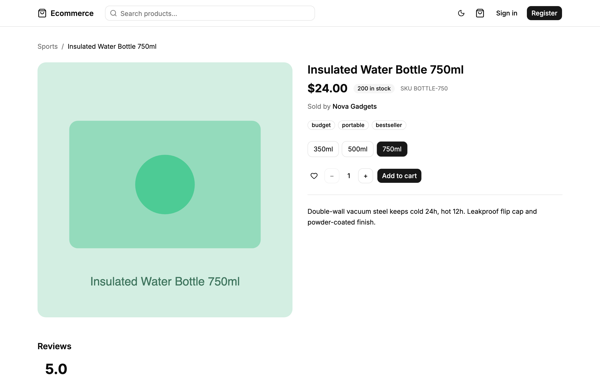 |

| Cart with coupon | Checkout |
| --- | --- |
| 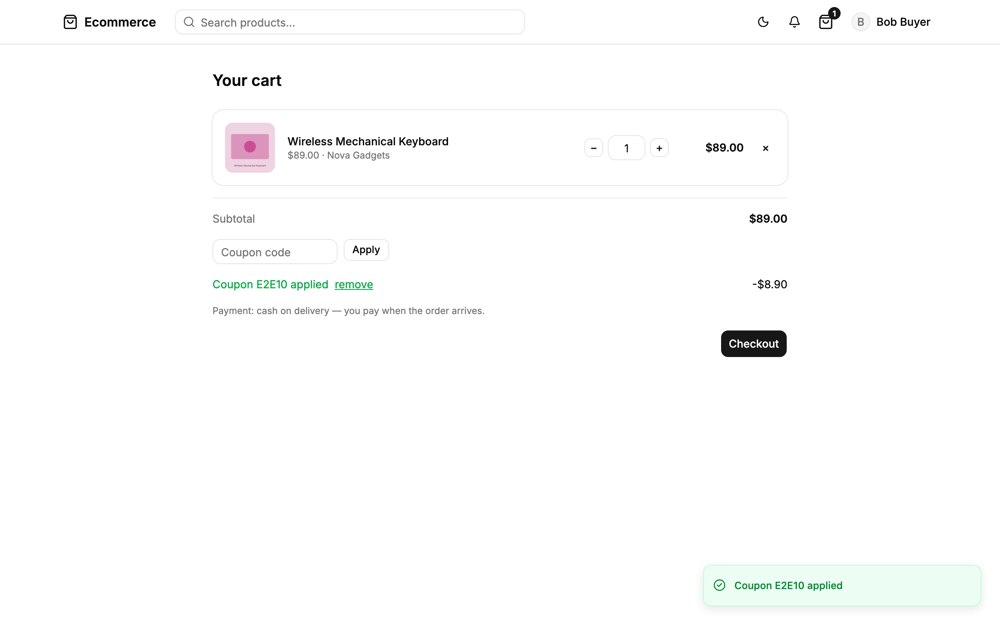 | 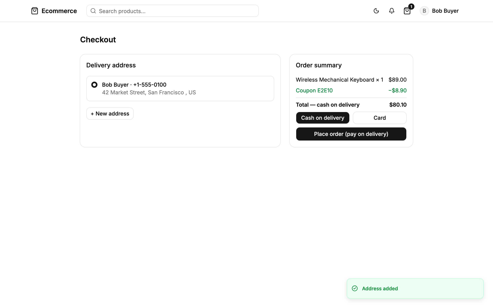 |

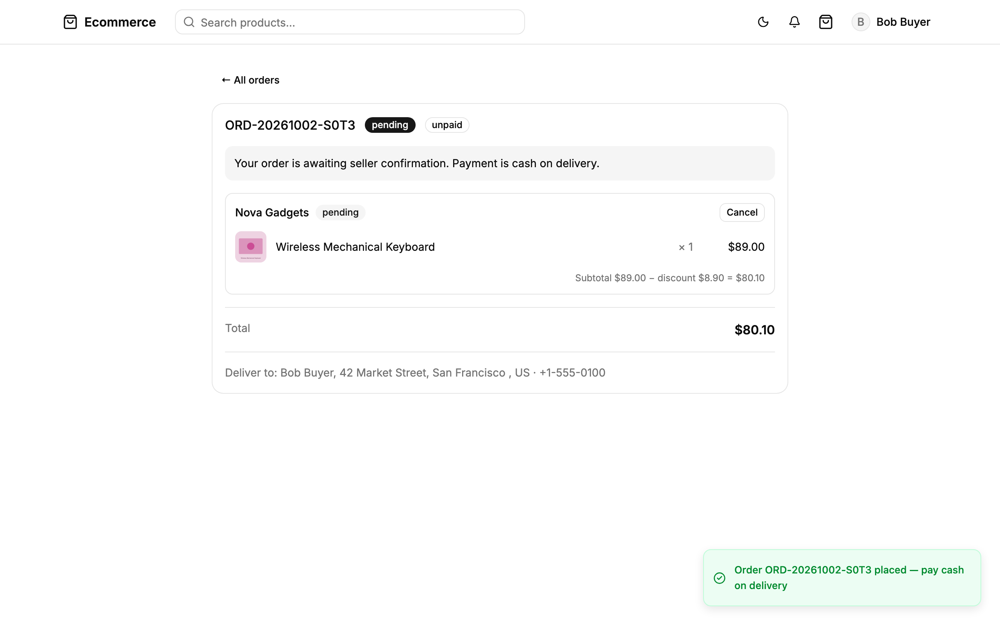

### 2. As a seller

1. **Dashboard** — sales, orders waiting for action, and an orders-per-day chart.
2. **Orders** — move each order along: **Confirm → Ship → Mark delivered**. For
   cash-on-delivery orders, record the payment with **Cash received**.
3. **Products** — create and edit products, upload images, add variants
   (sizes, colours) with their own price and stock, duplicate products, and
   import or export the catalog as CSV.
4. **Payouts** — see earnings after the marketplace commission and payouts
   received.
5. **Reviews** — reply to customer reviews.

| Seller dashboard | Incoming orders |
| --- | --- |
| 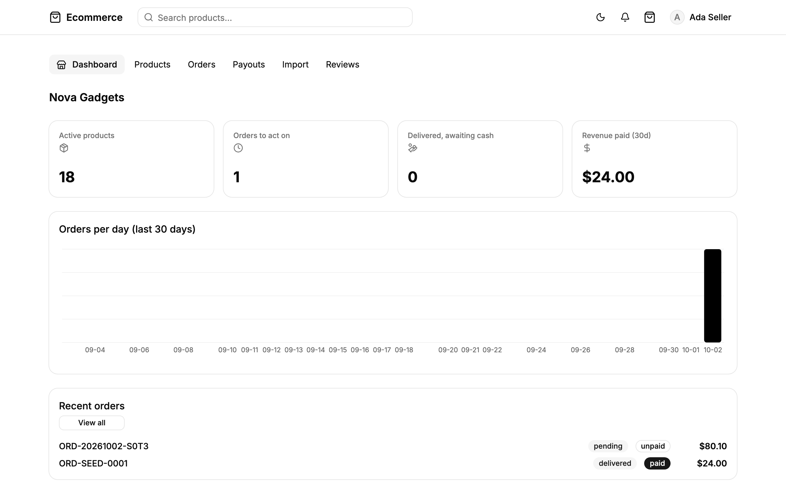 | 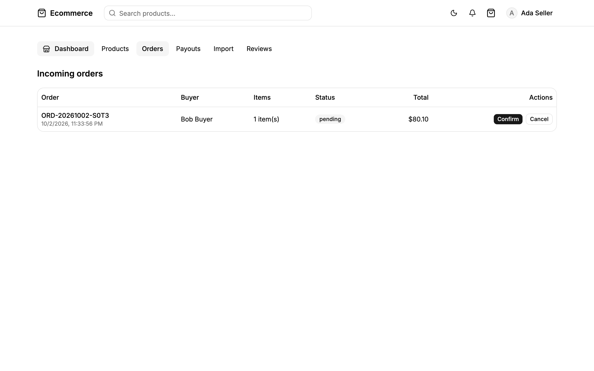 |

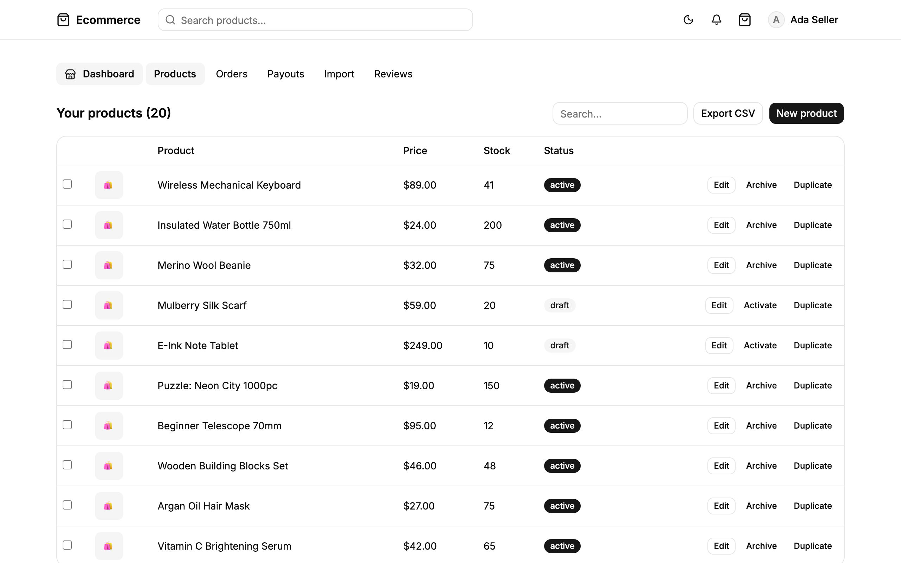

### 3. As the admin

1. **Dashboard** — users, sellers, products, orders and revenue at a glance;
   manage user roles and ban accounts.
2. **Catalog & Types** — categories, tags, and product types with custom
   attributes (e.g. "Material", "Size").
3. **Coupons** — create discount codes: percent, fixed amount or free
   shipping; marketplace-wide or for one shop; with usage limits and expiry.
4. **Payouts** — see what each shop has earned and record payouts.
5. **Reviews** — moderate reviews and handle reported ones.
6. **Settings** — set the marketplace commission, open or close sign-ups, and
   switch the store into maintenance mode.

| Admin dashboard | Store settings |
| --- | --- |
| 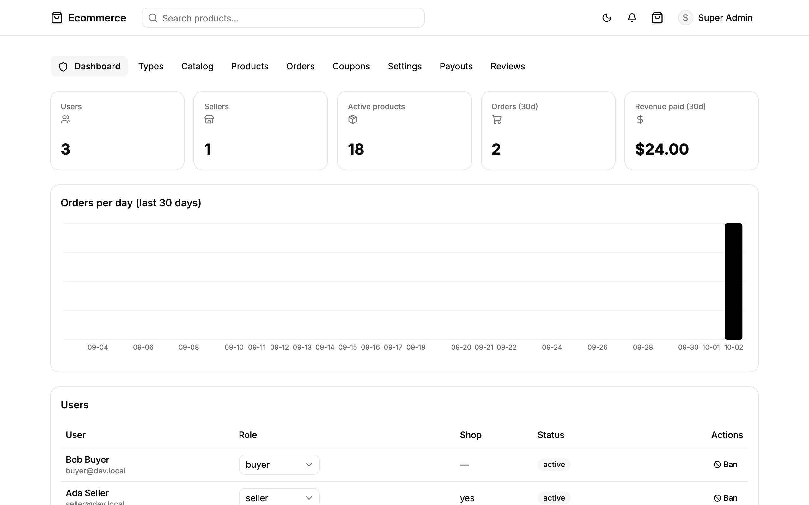 | 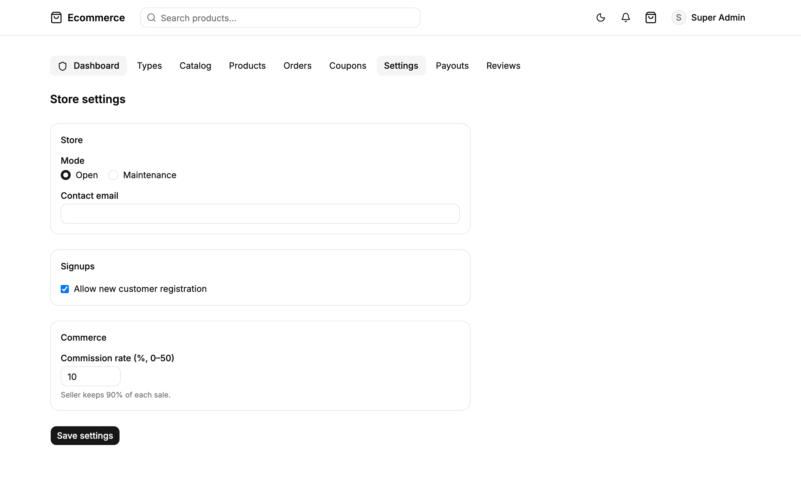 |

> Please don't switch on maintenance mode or ban the demo accounts — it would
> lock other visitors out.

---

## Features at a glance

- **Multi-vendor checkout** — one cart, many shops; each shop fulfils its own
  part of the order independently.
- **Product variants** — sizes, colours and other options, each with its own
  price, stock, SKU and image.
- **Payments** — cash on delivery and card payments (Stripe-ready; simulated
  in this demo), retry after a failed payment, automatic refund when a paid
  order is cancelled.
- **Coupons & promotions** — percent, fixed or free-shipping codes, global or
  per shop, with usage limits.
- **Seller earnings** — automatic commission, earnings statement and payouts.
- **Reviews** — verified-purchase reviews with photos, helpful votes, seller
  replies and abuse reporting.
- **Search & filters** — categories, price, rating, product attributes and SKU
  search.
- **Wishlist & notifications** — save products, get notified about order
  updates and when a saved item is back in stock.
- **Admin tools** — users and roles, catalog structure, coupons, payouts,
  moderation, store settings.
- **Light & dark mode**, responsive layout.

## Built with

TypeScript · React 19 · TanStack Start · PostgreSQL · Redis · S3-compatible
storage · Docker. Deployed on a VPS behind Cloudflare, with automatic deploys
on every update.

Developer documentation (setup, architecture, deployment):
[docs/DEVELOPMENT.md](docs/DEVELOPMENT.md).
